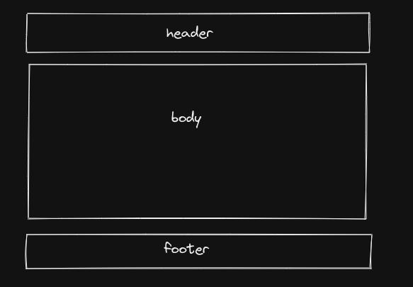
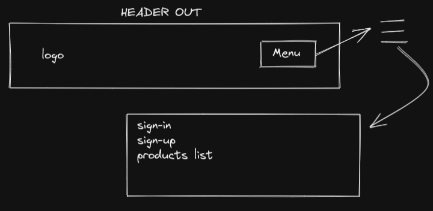
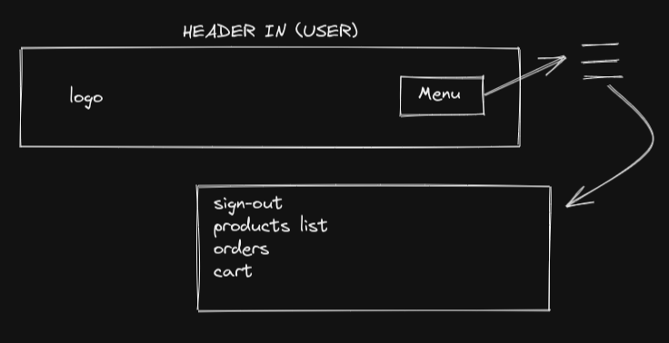
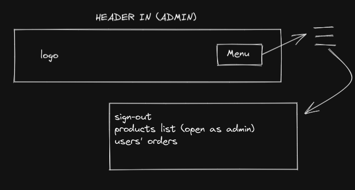
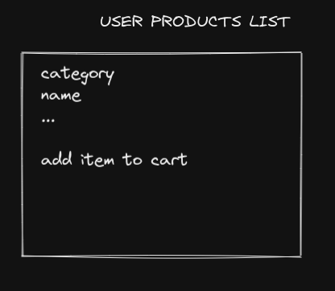
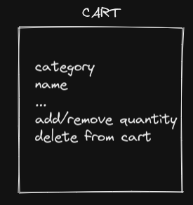
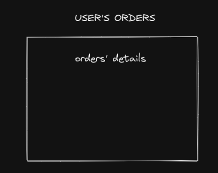
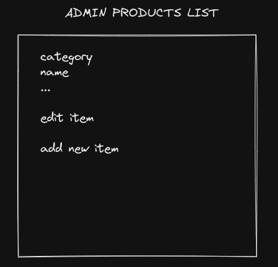
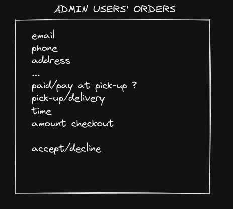
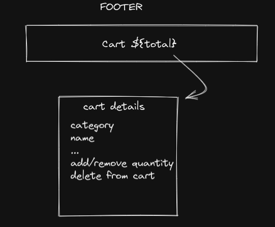

# E-commerce app

## Requirements

* MongoDB install on your local machine or enter your cluster credentials in .env

* Node/npm

## Install

* clone or fork repository

* install dependecies ```npm install``` or ```npm install``` in e-commerce directory and ```cd public && npm install``` in e-commerce/public directory

## Scripts

```npm start: run production```

```npm test-prod: run test production```

```npm run desktop: run only react app```

```npm run build-react: run npm run build for react app to create static files```

```npm run dev: run concurrently back-end + front-end```

## Log in test

* use ```admin@gmail.com``` with no password to test admin side

* use ```foo@gmail.com``` with no password or sign up with only email to test users side

# todo - front-end

* add account section

* add button to upload img

* at checkout add delivery options and select available slot

* users have to enter postcode and address in checkout

# todo - back-end

* add session/cookie

* change from findOne to findById in /add-item-to-products-list etc, OR write a function to retrieve user logged in to call everytime

* edit /sign-up for production

* edit /sign-in for production

* edit /sign-out for production

* add edit/delete account endpoints

* add /upload-img endpoint

* delete add-item-to-cart and others endpoints about cart

* add /save-cart endpoint to store cart in DB

* edit /checkout with stripe

* send notification to user when admin accepts or declines order

* send notification to admin when user makes a new order

# Endpoints

## Both users and admin

1. login

2. logout

3. register

## Users

1. add to cart

2. edit quantity item in cart

3. delete item from cart

4. checkout

5. see order/s

## Admin

1. add item to products list

2. edit item in products list

3. delete item in products list

4. see users orders

5. accept/decline user's order

# MongoDB models

## User

* email
* password
* username
* address
* payment method
* cart
* orders
* admin: true || false

## ProductsList

* name
* price
* currency?
* description
* category
* picture

# Front-end

## Layout



## Header

* header out (user and admin are logged off)



* header when user is logged in



* header when admin is logged in



## Body

* products list is selected



* cart is selected



### User is logged in


* orders is selected



### Admin is logged in

* products list




* orders



## Footer

* show cart total and when pressed show cart in body

